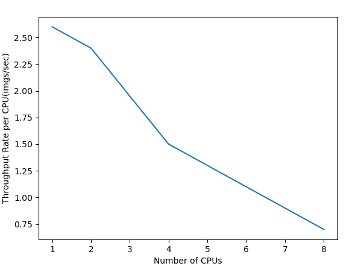
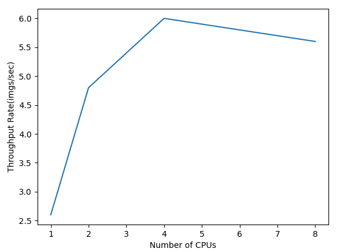
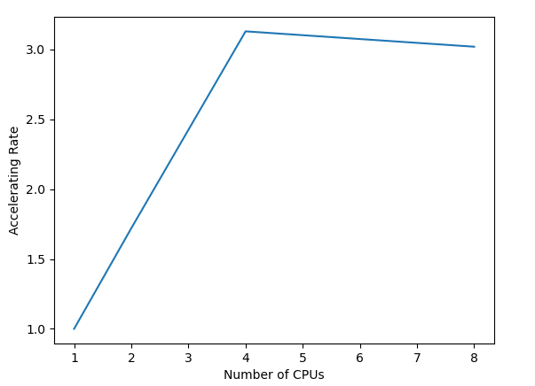

# 实验7报告

## 1. 实验环境

### 1.1 硬件环境

CPU(vCPU数目): `Intel® Core™ i7-9750H CPU @ 2.60GHz × 8 `

GPU(型号，数目): `GeForce RTX 2080 with Max-Q Design/PCIe/SSE2 × 1`

### 1.2 软件环境

OS版本: `Ubuntu 18.04.5 LTS`

深度学习框架, python包名称及版本: `Pytorch 1.5, Tensorflow 1.15.0`

CUDA版本: 11.0

## 2. 实验结果

1. 测试服务器间加速比

|          |             |                 |              |              |              |
| -------- | ----------- | --------------- | ------------ | ------------ | ------------ |
| 通信后端 | 使用CPU数量 | 平均每步耗时    | 平均吞吐率   | 总吞吐率     | 加速比       |
| MPI      | 
 1  | 
 244.66 | 
 2.5 | 
 2.5 | 
1    |
| MPI      | 
 2  | 
 143.76 | 
 2.5 | 
 5.0 | 
1.72 |
| MPI      | 
 4  | 
 77.44  | 
 1.6 | 
 6.2 | 
3.15 |
| MPI      | 
 8  | 
 82.46  | 
 0.6 | 
5.4  | 
3.04 |
|          |             |                 |              |              |              |

2.	总结加速比的图表、比较不同通信后端的性能差异、分析可能的原因
   分别动用1、2、4、8个CPU进行训练任务
3.	每个CPU的吞吐率：
   
   总吞吐量：

&nbsp;&nbsp;&nbsp;&nbsp;&nbsp;&nbsp;&nbsp;&nbsp;&nbsp;&nbsp;
加速比：

&nbsp;&nbsp;&nbsp;&nbsp;&nbsp;&nbsp;&nbsp;&nbsp;&nbsp;&nbsp;
程序使用更多的CPU，单个CPU的吞吐率下降，而总吞吐率在CPU数为4时达到最高，使用8个CPU时，吞吐率下降。因为使用更多CPU进行计算时，程序能使用更多计算资源，提高吞吐率。而本机的CPU事实上只有4个CPU核心（4核心8线程），动用8个CPU，需使用了超线程技术，由于CPU勤于在不同线程之间进行切换，可能增大了开销，使得吞吐率变小。

3. （可选）比较不同模型的并行加速差异、分析可能的原因（提示：计算/通信比）

   |          |             |               |              |               |              |
   | -------- | ----------- | ------------- | ------------ | ------------- | ------------ |
   | 通信后端 | 使用CPU数量 | 平均每步耗时  | 平均吞吐率   | 总吞吐率      | 加速比       |
   | MPI      | 
 1  | 
 86.4 | 
 7.5 | 
 7.7  | 
1    |
   | MPI      | 
 2  | 
 55.6 | 
 5.9 | 
 11.7 | 
1.55 |
   | MPI      | 
 4  | 
 37.4 | 
 4.5 | 
 17.3 | 
2.34 |
   | MPI      | 
 8  | 
 40.3 | 
 2.2 | 
 16.9 | 
2.16 |
   |          |             |               |              |               |              |

   
   可见，对于Resnet18来说，多核并行的加速效果不如Resnet50显著。
   

