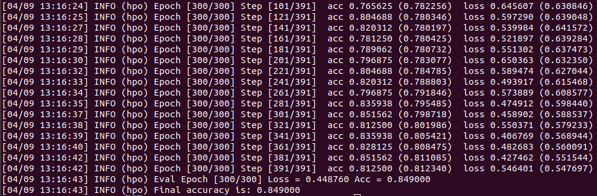
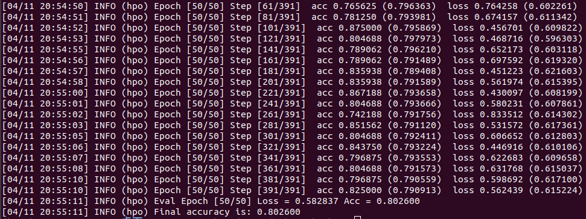
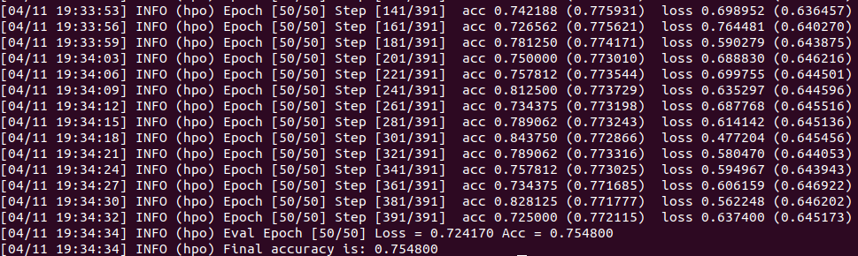
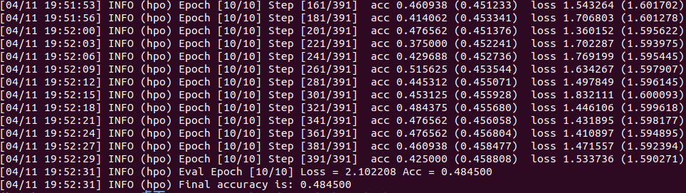
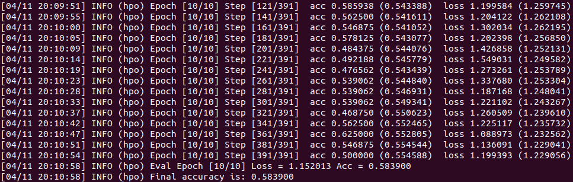
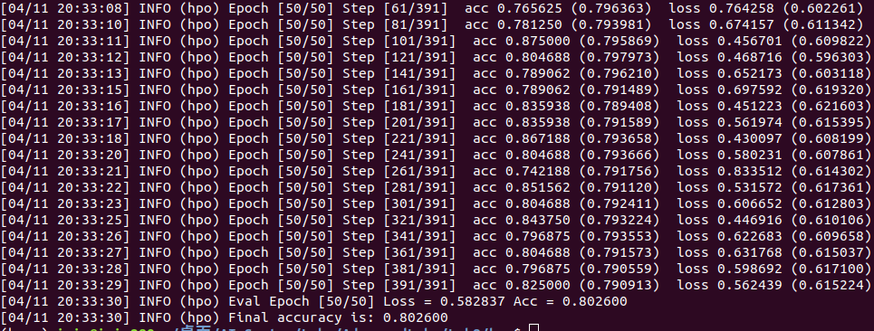
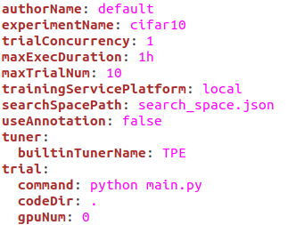
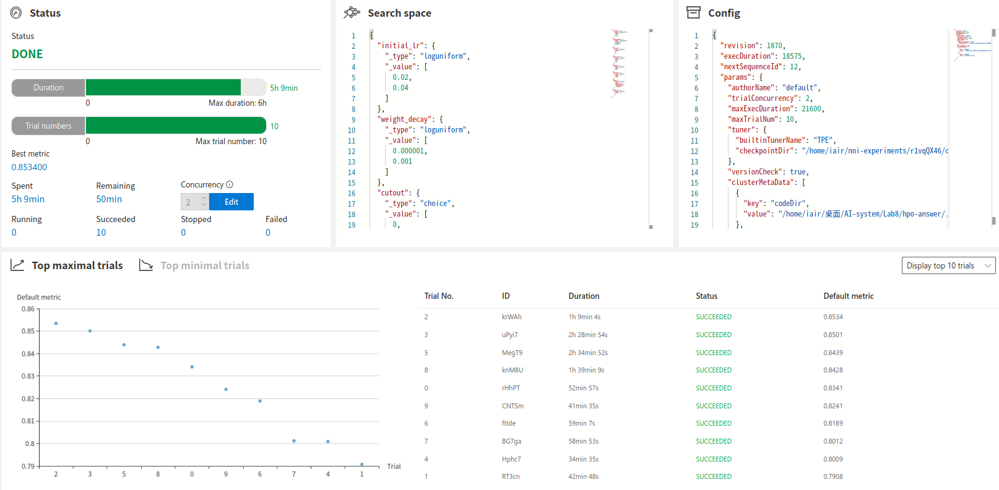

# 实验8报告

## 1. 实验环境

### 1.1 硬件环境

CPU(vCPU数目): `Intel® Core™ i7-9750H CPU @ 2.60GHz × 8 `

GPU(型号，数目): `GeForce RTX 2080 with Max-Q Design/PCIe/SSE2 × 1`

### 1.2 软件环境

OS版本: `Ubuntu 18.04.5 LTS`

深度学习框架, python包名称及版本: `Pytorch 1.5, Tensorflow 1.15.0`

CUDA版本: 11.0

## 2. 实验结果

1. 记录不同调参方式下，cifar10程序训练结果的准确率。

|                                                       |                                              |                                        |
| ----------------------------------------------------- | -------------------------------------------- | -------------------------------------- |
| 调参方式                                              | &nbsp; &nbsp; 超参名称和设置值 &nbsp; &nbsp; | &nbsp; &nbsp; 模型准确率 &nbsp; &nbsp; |
| &nbsp;   &nbsp; 原始代码 &nbsp;   &nbsp;    | ResNet18 initial_lr=0.1 epochs=300           |      |
| &nbsp;   &nbsp; 手动调参1 &nbsp;   &nbsp;   | ResNet18 initial_lr=0.01 epochs=50           |       |
| &nbsp;   &nbsp; 手动调参2 &nbsp;   &nbsp;   | ResNet50 initial_lr=0.01 epochs=50           |       |
| &nbsp;   &nbsp; 手动调参3 &nbsp;   &nbsp;   | ResNet18 initial_lr=0.01 epochs=10           |       |
| &nbsp;   &nbsp; 手动调参4 &nbsp;   &nbsp;   | ResNet50 initial_lr=0.01 epochs=10           |       |
| &nbsp;   &nbsp; 手动调参5 &nbsp;   &nbsp;   | Vgg16 initial_lr=0.01 epochs=10              |       |
| &nbsp;   &nbsp; NNI自动调参 &nbsp;   &nbsp; | 自动调节                                     |         |
|                                                       |                                              |                                        |

2.	提交使用NNI自动调参方式，对 main.py、search_space.json、config.yml 改动的代码文件或截图。

 ||

 ||

 ||

3.	提交使用NNI自动调参方式，Web UI上的结果截图。

 ||